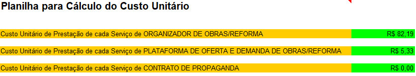

<h1>Proposta Financeira - CONSTRUMAX</h1>

<h3>Início</h3>

Nossa motivação para a criação do `ConstruMax` é oferecer soluções que auxilie tanto prestadores que buscam oportunidades quanto clientes que desejam mais opções e transparência.

Como somos uma empresa em construção apresentamos algumas abordagens de como avançaríamos em nosso negócio:

* Desenvolvemos uma versão demonstrativa do nosso MVP.
* Formalizamos nossa ideia inicial em uma apresentação base.
* Realizamos uma pesquisa da nossa aplicação frente ao público com o intuito de validar a ideia.

O próximo passo é apresentarmos uma estimativa numérica do crescimento de nosso negócio. Dividiremos este documento nos seguintes tópicos:

1. <b>Estimativas de crescimento </b>
2. <b>Entrada de Receita</b>
3. <b>Custo Unitário</b>
4. <b>Saída de Custo</b>
5. <b>Resumo do planejamento</b>

Clique <a href="Atividade - 3D - Financeiro - Template.xlsx_RevFinal.xlsx">aqui</a> para ter acesso aos nossos números.

<h3>Estimativas de crescimento</h3>

O `ConstruMax` tem o seu negócio voltado para o setor de serviços. Estamos estimando um elevado ganho de escala nos primeiros anos. Após consolidada nossa atuação, acreditamos que nossa taxa crescimento decairá marginalmente no longo prazo. O gráfico abaixo ilustra essa estimativa.

 Iremos focar na entrega dos seguintes serviços:

* Organizador de obras inteligente (Uma ferramenta que ajude na transparência e controle de todo o processo)
* Plataforma de oferta e demanda em serviços de construção (Uma rede de contatos entre prestadores de serviço e clientes)
* Contrato de propaganda (Fonte alternativa de receita)

<h3>Entrada de receita</h3>

Temos como plano incluir um preço único por usuário como fonte de receita. Porém, estrategicamente, vamos deixar grátis o uso da nossa aplicação com o intuito de ganhar usuários. Obtendo um publico, teremos sustentação para lançar um contrato de divulgação. 

A propaganda sendo divulgada na nossa plataforma, o usuário terá a opção de remove-la pagando o preço único.

O capital adquirido possibilitará a evolução do nosso serviço de Organizador de obras para Plataforma de contatos.

Segue abaixo o detalhado da entrada de recursos.

 

<b>Preço assinatura organizador :</b> R$ 12,00

<b>Preço assinatura plataforma: </b> R$ 15,00

<b>Preço contrato de propaganda: </b> R$ 1.000,00

Detalhamento das fases:

* <b>Fase 1:</b> Lançamento do organizador de forma gratuita. O usuário pode realizar doações correspondente ao valor da assinatura.
* <b>Fase 2:</b> Inicio da divulgação de produtos parceiros. Usuários tem a opção de pagar o preço de assinatura caso não deseje os anúncios. Doadores da fase anterior não serão afetados.
* <b>Fase 3:</b> Atualização da aplicação para plataforma de contatos. Reajuste do preço da assinatura de R$ 12,00 para R$ 15,00 para novos assinantes. Assinantes antigos não serão prejudicados. Estimativa de crescimento de assinaturas e contratos de publicidade.

<h3>Custo Unitário</h3>

Segundo artigo publicado pela consultaria <a href="https://aldabra.com.br/artigo/qual-o-custo-para-criar-um-aplicativo">Aldabra</a>, o custo para o desenvolvimento um aplicativo de apenas uma plataforma ( IOS / Android / WEB) varia de 15 a 30 mil reais, já em projetos multiplataformas a variação aumenta de 30 a 60 mil reais. Baseado nessa informação, buscamos estimar o custo unitário da nossa aplicação da seguinte forma:

<b>Organizador de obras inteligente</b>

* Durante a fase inicial iremos desenvolver para apenas um sistema operacional. No pior cenário o processo deve nos custar 30 mil reais. Supondo que nos primeiros 6 meses conseguimos converter 365 assinantes, o custo unitário do serviço Organizador de Obra seria de R$ 82,19 por assinante.

<b>Plataforma de oferta e demanda em serviços de construção</b>

* Na fase transição do organizador para plataforma de contato, estamos colocando na conta uma ampliação do projeto para outros tipos de sistema. Logo, haverá um novo investimento de R$ 60.000,00, mantendo o pior cenário. No segundo semestre estamos estimando um acréscimo de 11.250 assinantes. O custo unitário para este serviço ficaria por volta de R$ 5,33 por assinatura.

<b>Contrato de propaganda</b>

* Estamos incluindo o custo de elaboração do contrato em despesas com advogados por não se tratar de um custo referente a atividade principal de nossa empresa. Portanto o custo unitário para este serviço consta como zerado.

Segue imagens de como ficou representado na planilha.

<h3>Saída de Custo</h3>

Segue abaixo outros gastos que nossa empresa está sujeita a pagar:

<b>Gastos para criar a empresa</b>

- <i>Gastos com documentação:</i> O site <a href="https://www.contabilizei.com.br/contabilidade-online/quanto-custa-abrir-empresa-no-brasil-descubra-tudo/#:~:text=os%20primeiros%20passos.-,O%20custo%20para%20abrir%20uma%20empresa%20e%20ter%20um%20CNPJ,e%20o%20escrit%C3%B3rio%20de%20contabilidade.">Contabilizei</a> mostra que para abrir um cnpj varia de R$ 500,00 a R$ 1.500,00, dependendo do estado. Estamos supondo que vamos gastar R$ 500,00 para emitir esta documentação.
- <i>Gastos com máquinas e equipamentos:</i> Computadores e dispositivos de escritório (impressora, no-break, etc).
- <i>Gastos com reforma do imóvel:</i> Pintura, hidráulico e elétrica.
- <i>Gastos com móveis e utensílios:</i> Compra de escrivaninha.
- <i>Advogado:</i> Consultoria jurídica referente aos contratos publicitários.
- <i>Desenvolvimento Android / IoS / Site / Sistema Web:</i> Consultoria sobre como implementar o projeto de forma efetiva.

<b>Despesas com operação</b>

* <i>Despesas com salário:</i> Dependendo do ganho de assinantes estamos pensando em contratar um profissional no segundo semestre.
* <i>Retiradas dos sócios:</i> No primeiro ano não devemos realizar nenhuma retirada em prol do investimento do nosso negócio.
* <i>Comissões Vendas:</i> Estamos com um plano de contratar influenciadores da área para divulgar nosso serviço nas redes sociais.
* <i>Investimento em Marketing: </i>Banners em locais estratégicos como lojas de material de construção ou estandes dentro de condomínios residenciais.
* <i>Processadoras de pagamento:</i> Mensalidade estimada do quanto devemos gastas com serviços financeiros.
* <i>Hospedagem:</i> Neste primeiro momento vamos focar no nosso mercado local, futuramente devemos ter algum plano de expansão que exija gastos com hospedagem.
* <i>Despesa com serviços:</i> Gastos com limpeza e manutenção de hardware.
* <i>Outras despesas:</i> Gastos com itens pequenos (pilhas, canetas, material de escritório no geral).

<h3>Resumo do planejamento</h3>

No primeiro ano teremos um resultado fraco devido ao período de adaptação. Contudo se nosso investimento em marketing forem bem sucedidos, iremos ter um crescimento elevado nos próximos anos com uma taxa interna de retorno estimada de 227,4% ao ano.

  