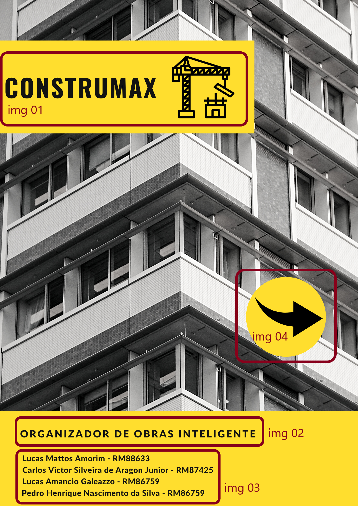
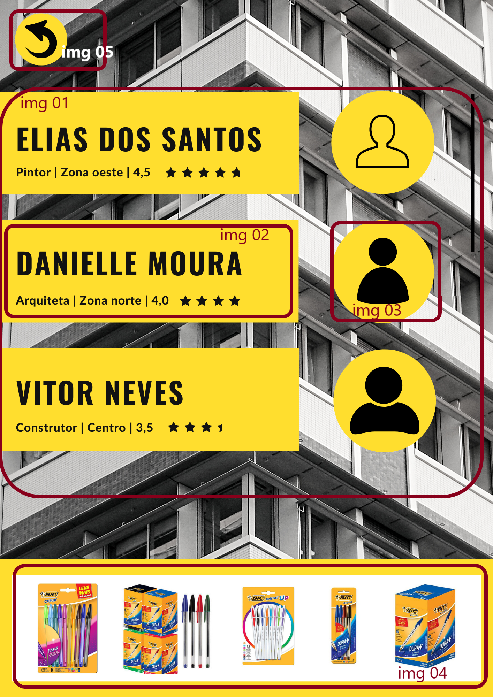
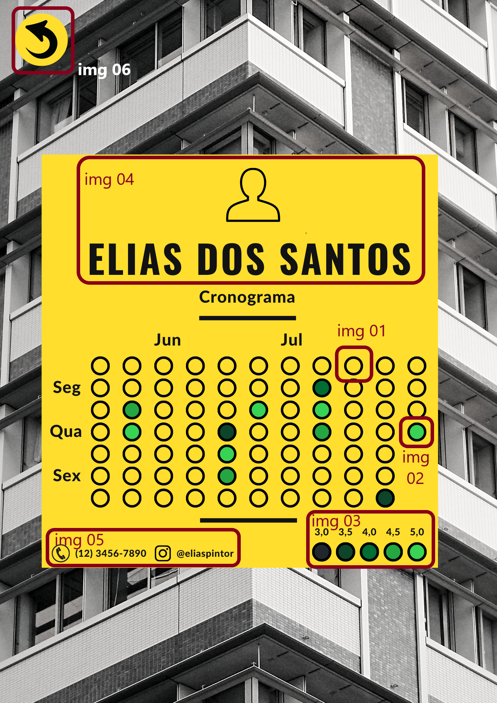
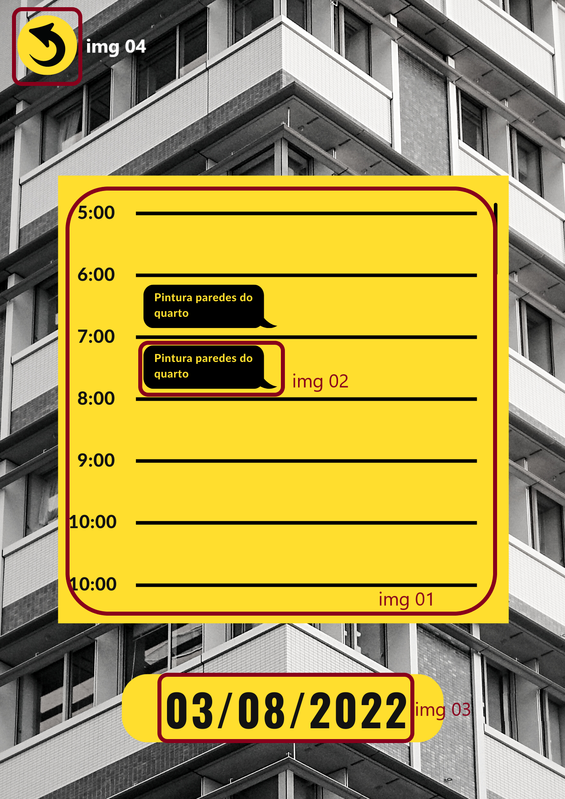
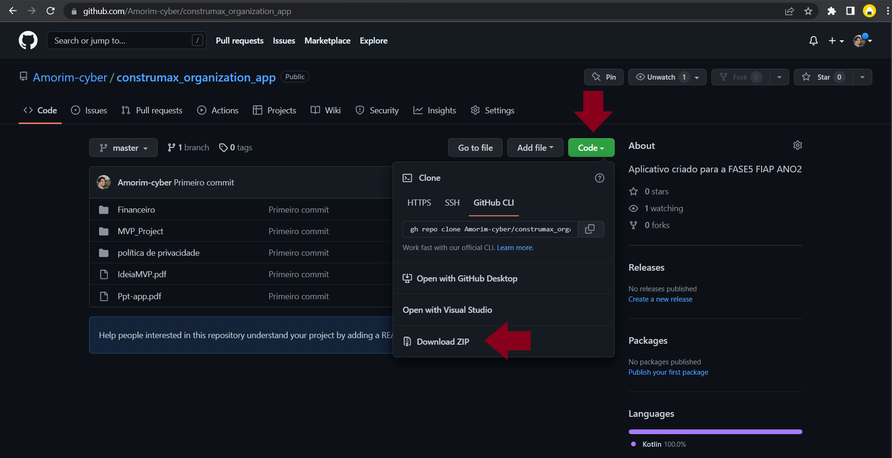
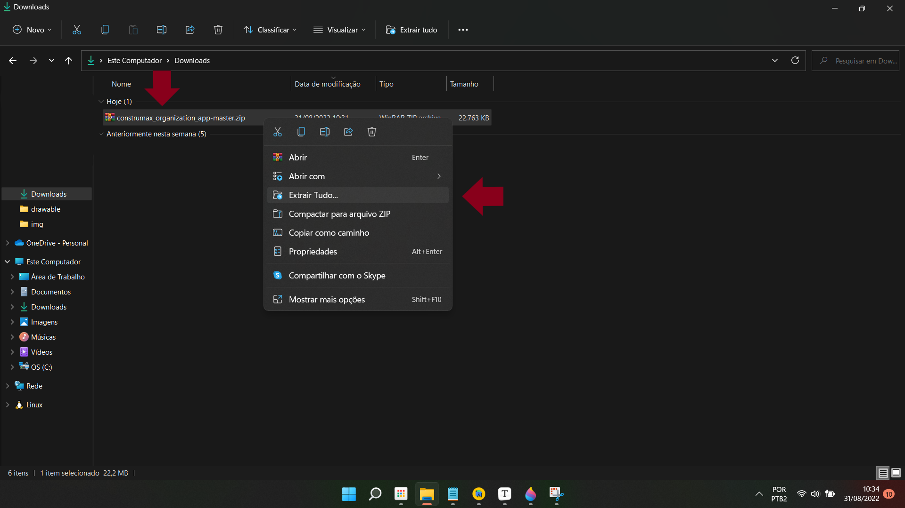
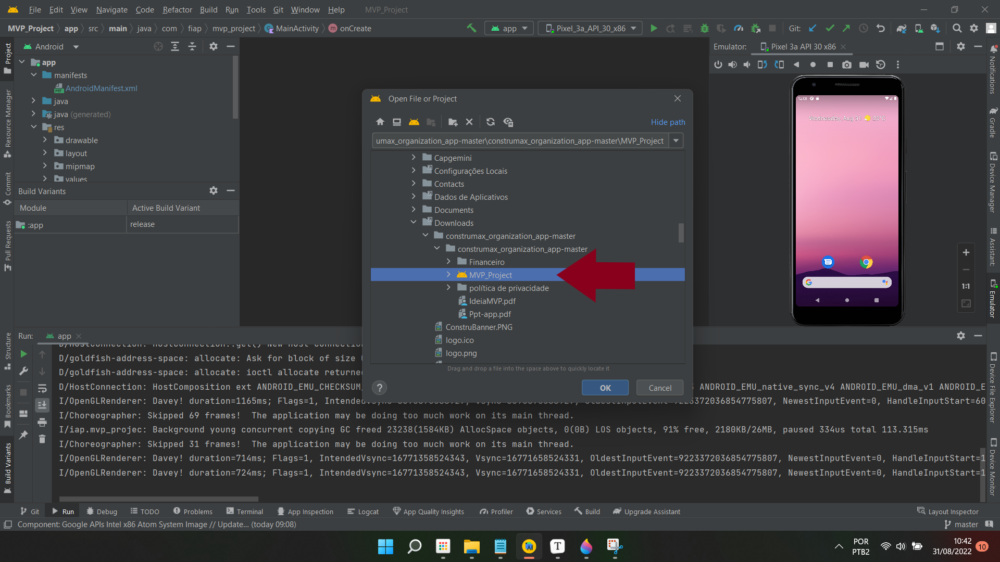

<h1>CONSTRUMAX ORGANIZATION APP</h1>

<h3>Início</h3>

Com o intuito de tornar mais produtivo e profissional o serviço de reformas/obras desenvolvemos uma versão inicial do `CONSTRUMAX ORGANIZATION APP`.

<B>Definição da aplicação:</B>

A proposta do <a href="https://github.com/Amorim-cyber/construmax_organization_app">app</a> seria de funcionar como um organizador de obras. O usuário teria o acesso a uma listagem de profissionais participantes de um determinado projeto de reforma. Cada profissional teria o seu próprio cronograma de tarefas a serem desempenhadas. A tarefa registrada e concluída passa para um crivo que influencia o desempenho geral do profissional.

<i>Está uma versão meramente ilustrativa e pode sofre alterações futuras.</i>

<h3>Navegação</h3>

Desenvolvemos 4 telas para a ilustrar nossa ideia de usabilidade:

* <b>(1) Tela inicial</b>
* <b>(2) Listagem de participantes</b>
* <b>(3) Cronograma</b>
* <b>(4) Registro de atividades</b>

O aplicativo segue a seguinte ordem: (1) Tela inicial >> (2) Listagem de participantes >> (3) Cronograma >> (4) Registro de atividades. Vamos explicar detalhadamente cada item na integra.

Veja o <a href="assets/vid01.mp4">vídeo</a> sobre a navegação.

<h4>(1) Tela inicial</h4>

</img>

A capa de nossa aplicação, é nesta imagem que ilustramos nossa logo <i style="color:#88001b">(img 01)</i>, uma breve descrição da nossa proposta <i style="color:#88001b">(img 02)</i> e por fim o nome dos colaboradores que participaram do projeto <i style="color:#88001b">(img 03)</i>. Para seguir para a próxima tela o usuário deverá clicar na seta localizada no centro <i style="color:#88001b">(img 04)</i>.

<h4>(2) Listagem de participantes</h4>

</img>

A tela seguinte exibe uma lista dos profissionais que estão participando de uma determinada obra <i style="color:#88001b">(img 01)</i>. Cada retângulo informa o nome, a ocupação, a área de atuação e sua avaliação geral <i style="color:#88001b">(img 02)</i>. Do lado de cada retângulo há um espaço reservado para o profissional incluir uma foto de identificação caso deseje <i style="color:#88001b">(img 03)</i>. A página de cronograma é aberta quando o usuário clica tanto no retângulo quanto na imagem do profissional.

A avaliação geral é referente ao desempenho do profissional ao longo de todo o processo de obra. Na tela de cronograma explico como é mensurada essa nota.

No rodapé dessa página, realizamos um pequeno teste de viabilidade de anúncios <i style="color:#88001b">(img 04)</i>. As imagens são meramente ilustrativas e não estamos recebendo nenhum valor em divulga-las.

O usuário poderá voltar para a tela inicial caso clique na seta localizada no canto esquerdo superior da imagem <i style="color:#88001b">(img 05)</i>.

<h4>(3) Cronograma</h4>

</img>

O cronograma irá mostrar os dias de trabalho que cada profissional executou, dias estes representados pelas bolinhas localizadas no centro da imagem. As bolinhas amarelas são os dias que o profissional não atuou <i style="color:#88001b">(img 01)</i>. 

Já as bolinhas verdes <i style="color:#88001b">(img 02)</i> são os dias que o profissional prestou serviço. Reparem que umas são diferentes das outras em tonalidades. Cada tonalidade representa uma nota, quanto mais berrante a cor, maior é a nota. A graduação é representada abaixo no canto direito inferior da tela <i style="color:#88001b">(img 03)</i>.

Quem determina a nota é o cliente, que no final de cada serviço dá seu feedback. A nota geral do profissional corresponde a média aritmética das notas diárias.

Além de trazer o nome e a imagem do profissional <i style="color:#88001b">(img 04)</i>, a tela de cronograma também informa o número de telefone para contato e sua identificação nas redes sociais caso tenha <i style="color:#88001b">(img 05)</i>.

A seta localizada no canto superior esquerdo da tela leva para a página anterior quando clicada <i style="color:#88001b">(img 06)</i>.

 <h4>(4) Registro de atividades</h4>

</img>

A tela onde o usuário registra suas atividades do dia. No centro da tela <i style="color:#88001b">(img 01)</i> encontra-se os horários do dia, no espaço entre as horas é aonde o usuário pode efetuar o registro <i style="color:#88001b">(img 02)</i>.

Na parte inferior da tela <i style="color:#88001b">(img 03)</i> podemos visualizar o dia selecionado.

A seta localizada no canto superior esquerdo da tela retorna para página anterior <i style="color:#88001b">(img 04)</i>.

<h3>Como acessar o projeto em sua maquina</h3>

No <a href="">github</a> há um botão verde denominado `"code"`, clique nele. Ele vai te dar várias opções de como visualizar os arquivos. Clique em `"Download ZIP"`.

</img>

O arquivo ZIP vai aparecer em sua pasta de Downloads, descompacte (ou extraia dependendo da versão do seu computador) clicando com o botão direito do mouse. Mova a nova pasta criada para o diretório de sua escolha.

</img>

Abra o `android studios` ou outra IDE de sua escolha e peça-o para procurar a pasta  `"MVP_Project"`.

</img>

Veja o <a href="assets/vid02.mp4">vídeo</a> sobre a instalação.

   

<h3>Arquivos adicionais</h3>

* <a href="IdeiaMVP.pdf">Telas do aplicativo</a>
* <a href="Ppt-app.pdf">Apresentação em ppt da nossa proposta</a>
* <a href="Financeiro/README.pdf">Plano de negócios do aplicativo</a>

<h4>Forte Abraço!</h4>