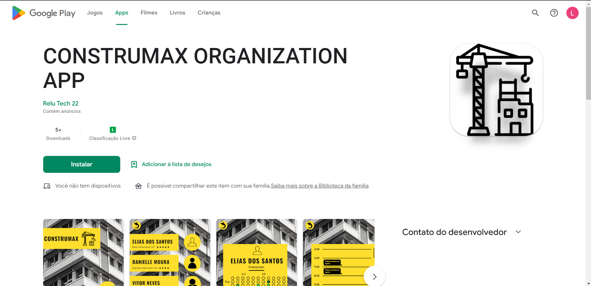
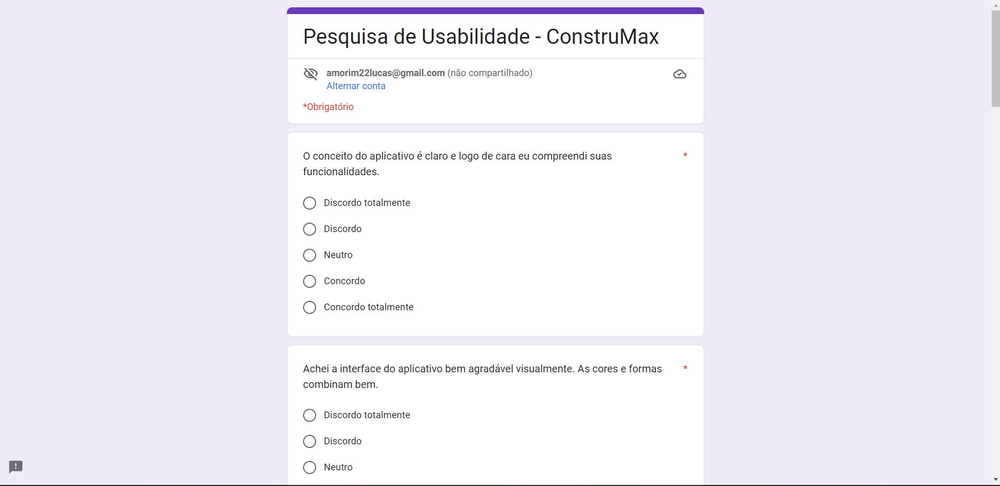

<h1>Validação CONSTRUMAX ORG APP</h1>

Ao longo do ultimo mês nosso time desenvolveu uma solução para participantes do mercado de construção civil. 

Nosso <a href="https://github.com/Amorim-cyber/construmax_organization_app">app</a>, o `CONSTRUMAX ORGANIZATION APP` tem como proposta desempenhar o papel de um organizador de obras/reformas. O usuário teria acesso a uma lista dos colaboradores podendo consultar seus cronogramas e as atividades que foram realizadas no dia.

Este documento tem como finalidade mostrar os resultados da validação do nosso app perante ao público. Nosso processo de validação foi planejado da seguinte forma:

1. Publicamos nosso MVP na plataforma `Google Play`.
2. Divulgamos o link do app em nossas redes de contato junto com um formulário de pesquisa.

Qualquer pessoa que baixasse o aplicativo via smartphone com sistema operacional `android` teria um contato direto com as nossas telas. O formulário foi disponibilizado com a finalidade de registrar o feedback.

<h3>Sobre a publicação</h3>

O aplicativo está disponibilizado na <a href="https://play.google.com/store/apps/details?id=com.fiap.mvp_project">loja</a> do Google Play. Foram mais de 5 downloads até o momento. Fique a vontade para baixar e testar.

<h3>Sobre o formulário</h3>

Criamos este <a href="https://docs.google.com/forms/d/e/1FAIpQLSdJ-DNnU9cLGzs5ppXb6LRHFRW4uTFdkyCFJnONQ2iRhS-njg/viewform">formulário</a> para o usuário expressar sua opinião a respeito da nossa ideia. Também demos abertura para sugestões. 

<h3>
    Resultado da pesquisa
</h3>

Até o momento obtivemos 24 avaliações. Na visão geral aproximadamente 95% do público apoia nossa iniciativa, 4% discorda e 1% permaneceu neutra. Alguns sugeriram uma mudança nas cores de nosso layout. 

Podemos concluir que nossa ideia está no caminho certo, dando oportunidade para desenvolvermos atributos mais complexos para nossa aplicação.

<h3>Forte abraço</h3>

